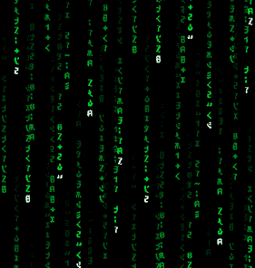

<h1 align="center">Hi, I'm Ahmed Emad </h1>
<h3 align="center">Digital IC Design, ASIC & Embedded Systems Engineer</h3>

---

## 📖 About Me

- 🎓 Undergraduate **Communication Engineering Student (ECE)**

- 💻 Currently learning **Verilog, ASIC Flow, and Verification**
- 👨‍🏫 Instructor in **Digital Design & Hardware** 
- 🤝 Seeking collaboration on **Digital IC Design, ASIC, and Embedded Systems Projects**
- 🏅 [Certificates](https://drive.google.com/drive/folders/1yynA24OzWugxN8eEFZlnseJDQ4_q_3HI?usp=sharing)
- ⚡ Passionate about **Chip Design, Hardware Projects, and PCB Design**  
- 📧 My Business Email: **ahmedemadaboelsauud@gmail.com**
 
  
## 🌐 Connect with Me 

  
  &nbsp;&nbsp;
  
  &nbsp;&nbsp;
  
  &nbsp;&nbsp;
  </a>
     

 

## 🛠️ Skills  

### 💻 Languages  

  <code></code>
  <code></code>
  <code></code>
  <code></code>
  <code></code>
  <code></code>

 

### ⚙️ Tools & Platforms  

  <code></code>
  <code></code>
  <code></code>
  <code></code>
  <code></code>
  <code></code>
  <code></code>
  <code></code>
  <code></code>
  <code></code>
  <code></code>
  
     
  

  

---

## 📊 GitHub Stats  

  
  

---

<h3 align="center">👀 Profile Views</h3>

  
    
  

